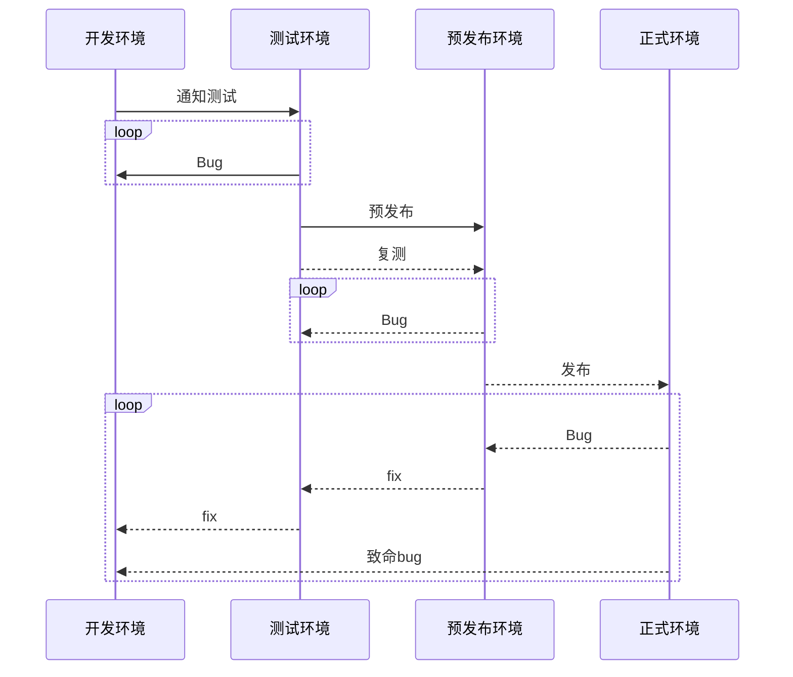

# 测试工作流程

VERSION `内部版本v1.0`

```mermaid
sequenceDiagram
    participant A as 开发环境
    participant B as 测试环境
    participant C as 预发布环境
    participant D as 正式环境

    A->>B: 通知测试
    loop
    B->>A: Bug
    end

    B->>C: 预发布

    B-->>C: 复测
    loop
    C-->>B: Bug
    end

    C-->>D: 发布
    loop
    D-->>C: Bug
    C-->>B: fix
    B-->>A: fix
    D-->>A: 致命bug
    end
```
