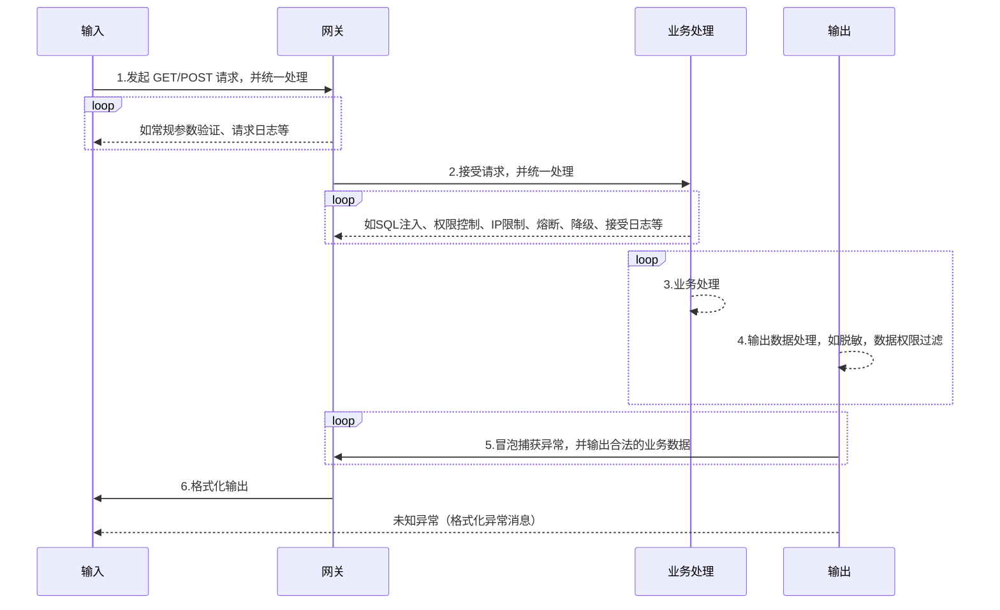

# 开发规范

VERSION `内部版本v1.0`

## 目的

为了保证企业编写出的程序都符合相同的规范,保证一致性、统一性而建立的数据库命名规范。

> 编码规范对于程序员而言尤为重要,有以下几个原因:

- 1、一个项目的生命周期中,80%的花费在于维护;
- 2、几乎没有任何一个项目,在其整个生命周期中,均由最初的开发人员来维护;
- 3、命名规范可以改善项目的可读性,可以让程序员尽快而彻底地理解新的代码;
- 4、如果你将源码作为产品发布,就需要确任它是否被很好的打包并且清晰无误,比如你已构建的其它任何产品。

## 范围

适合于本项目中编写的命名规则

## 规范项

### 常规规范

- 1、所有涉及到状态码的全部建立枚举并同步到对应PDM字段;

### PDM同步

- 1、PDM设计、修改权限回收;
- 2、向所有开发人员开放PDM读取权限;
- 3、所有开发人员必须高度依赖PDM;
- 4、首先从数据库更新到PDM中(只会自动差异更新);
- 5、所有数据库修改必须发给指定负责人生成并生成脚本同步到正式库、测试库、开发库;
- 6、发起数据库修改的人同时负责代码中的实体更新。

### 当需求数据接口/PROC/FUNCTION

- 1、遵循标准传输协议;
- 2、开发过程中,首先定义输入输出参数、类型(微调除外);
- 3、提供接口空方法体模拟返回数据,方便调用方工作推进;
- 4、关于接口文档,原则上谁提供的接口谁负责添加接口文档;
- 5、关于接口修改,需同步更新接口文档,并在技术群里发送更新信息。

### 关于任务计划、安排

- 1、任务计划分配者需清晰地了解任务需求,确保接受任务者理解到位;
- 2、任务过程中途要关注任务进行情况,确保任务过程中不会走偏;
- 3、任务过程中若遇到问题卡住,并自己不知如何处理,需快速暴露出来,寻求团队的帮助。

### 任务提交

- 1、按照任务清单、按照紧急程度完成任务;
- 2、若上报已经完成的任务,则请提供相关测试数据脚本、测试用例,若未提供,则认为任务未完成;
- 3、任务完成后,原则上对本人程序bug负责修改。

### 错误等级

- 一级严重:错误导致软件崩溃;
- 二级严重:错误导致一个特性不能运行并且没有替代方案;
- 三级严重:错误导致一个特性不能运行但有替代方案;
- 四级严重:错误是表面化的或是微小的。

### API接口统一输入输出

服务地址:`http://api.domain.com`

请求方式:`HTTP GET/POST`

API输入输出流程：



#### 入口

> `{basic:{token:TOKEN,sign:SIGN,version:VERSION},param:{apiname:APINAME,apiparam:APIPARAM}}`

参数说明:

- basic:基础通信基本参数
  - TOKEN:有效TOKEN
  - SIGN:根据签名规则生成的签名
  - VERSION:请求的API版本
- param:服务调用参数
  - APINAME:API名称
  - APIPARAM:请求API时,需要传入的参数

#### 出口

- success:`{code:s001,msg:"",data:{ name:"张三" code:"0001"}}`
- fail `{code:s002,msg:"用户名不能为空",data:{}}`

> `例: .NET`

```csharp
/// <summary>
/// 标准接口返回对象
/// </summary>
public class APIJsonResult
{
    // 返回代码
    public string code{get;set;}

    // 提示信息（若调用服务在服务器端抛出异常,则可以通过msg获取友好提示,如果执行成功则改字段为空字符串）。
    public string msg{get;set;}

    // 返回数据对象json字符串（若该API接口为void,则该字段为空字符串）。
    public string data{get;set;}
}

/// <summary>
/// 标准接口返回错误代码
/// </summary>
public enum EErrorCode
{
    s001,//成功
    s002,//失败-请求参数错误
    s003,//失败-连接超时
    s004,//失败-内部错误(程序内部抛出友好异常)
    s005,//失败-未知错误
    //...
}

/// <summary>
/// 服务调用处理函数
/// </summary>
/// <param name="API_URL">API接口地址</param>
/// <param name="API_VERSION">API接口版本</param>
/// <param name="API_NAME">API接口名称</param>
/// <param name="API_Pamas">调用参数(json字符串)</param>
/// <param name="HTTP_MODE">HTTP请求方式GET/POST（默认GET）</param>
/// <returns>接口返回对象</returns>
public APIJsonResult CallAPI(API_URL,API_VERSION,API_NAME,API_Pamas,HTTP_MODE=HTTP.GET)
{
    // TOTO...
    // 组装基础通信基本参数
    // 通过HTTP GET/POST请求服务,返回数据
}

/// <summary>
/// 登陆
/// </summary>
/// <returns></returns>
public APIJsonResult Login()
{
    string url = "http://api.domain.com";

    // 模拟登陆参数
    var paramStr = {
        name:"s001",
        pwd:"123456",
    }.ToJson();
    var result = CallAPI(url,"v1.0","login",paramStr);
    if(result.code.Equals(EErrorCode.s001))
    {
        var user = result.ToObject<User>();
        Console.WriteLine(user.LastLoginTime);
    }
    else
    {
        Console.WriteLine(result.msg);
    }
    return result;
}

/// <summary>
/// 登出
/// </summary>
/// <returns></returns>
public APIJsonResult Logout()
{
    string url = "http://api.domain.com";

    // 模拟登出参数
    var paramStr = {
        name:"s001",
        token:"2CCEBC544AED45DCA5D5E12CC2431E17",
    }.ToJson();
    var result = CallAPI(url,"v1.0","logout",paramStr);
    if(result.code.Equals(EErrorCode.s001))
    {
        Console.WriteLine("注销成功");
    }
    else
    {
        Console.WriteLine(result.msg);
    }
    return result;
}
```
